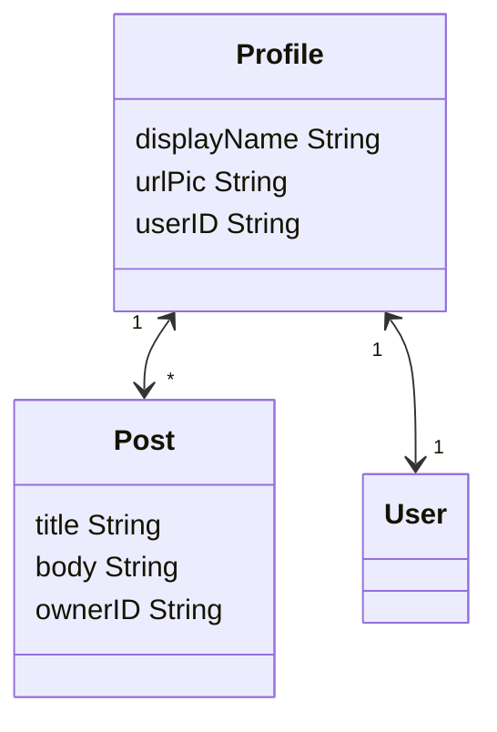

# Example of BadAas authentication and object storage

- [Example of BadAas authentication and object storage](#example-of-badaas-authentication-and-object-storage)
  - [Set up](#set-up)
  - [Model definition](#model-definition)
  - [Authentication](#authentication)
  - [Test it](#test-it)
  - [Explanation](#explanation)

## Set up

This project uses `badctl` to generate the files that allow us to run this example. For installing it, use:

<!-- TODO remove commit when badctl has a first tagged version -->
```bash
go install github.com/ditrit/badaas/tools/badctl@cbd4c9e035709de25df59ec17e4b302b3a7b9931
```

Then generate files to make this project work with `cockroach` as database:

```bash
badctl gen --db_provider cockroachdb
```

For more information about `badctl` refer to [badctl Docs](https://github.com/ditrit/badaas/tools/badctl/README.md).

Finally, you can run the api with:

```bash
badctl run
```

The api will be available at <http://localhost:8000>.

## Model definition

This example defines the following model [here](example.go):



The Users are stored on a classic sql table outside of the object storage engine (EAV), so the userID will be a value. We will use the Profile object to store info about the users.

For now we need to setup the schema manually using a invoke function that will run at the initialization of the programme. Make sure that the database you are gonna use is empty.

## Authentication

Currently we only support a basic authentication using an email and a password.
The default credentials for the user are ̀`admin-no-reply@badaas.com` and `admin`.

## Test it

httpie util will be used in the examples below, but it works with curl or any similar tools.

Let's first start by checking the route this example adds:

```bash
http localhost:8000/hello
```

```json
HTTP/1.1 200 OK
Content-Length: 13
Content-Type: application/json
Date: Thu, 04 May 2023 09:32:29 GMT

"hello world"
```

Then, we can test the routes provided by BadAss

Get all the profiles:

```bash
http localhost:8000/objects/profile
```

```json
HTTP/1.1 200 OK
Content-Length: 226
Content-Type: application/json
Date: Thu, 05 Jan 2023 11:53:35 GMT

[
    {
        "attrs": {
            "urlPic": "The Super Admin",
            "userId": "wowASuperCoolUserID"
        },
        "createdAt": "2023-01-05T12:47:41.166796+01:00",
        "id": "67c5c6dc-b82d-4c2a-9ab8-f7847a732086",
        "type": "profile",
        "updatedAt": "2023-01-05T12:47:41.166796+01:00"
    }
]
```

Get all the posts posted by this user:

```bash
http GET localhost:8000/objects/post ownerID=wowASuperCoolUserID
```

```json
HTTP/1.1 200 OK
Content-Length: 1626
Content-Type: application/json
Date: Fri, 06 Jan 2023 08:20:33 GMT

[
    {
        "attrs": {
            "body": "Lorem ipsum dolor sit amet, consectetur adipiscing elit.\n\n\t\tIn consectetur, ex at hendrerit lobortis, tellus lorem blandit eros, vel ornare odio lorem eget nisi.\n\n\t\tIn erat mi, pharetra ut lacinia at, facilisis vitae nunc.\n\t",
            "ownerID": "wowASuperCoolUserID",
            "title": "Why cats like mice ?"
        },
        "createdAt": "2023-01-06T09:18:53.313565+01:00",
        "id": "68facfa6-fe77-479b-a64e-f26344393a31",
        "type": "post",
        "updatedAt": "2023-01-06T09:18:53.313565+01:00"
    }
]
```

## Explanation

To understand why this example was made in this way refer to [BadAas Docs](https://github.com/ditrit/badaas/README.md#step-by-step-instructions).
